<h1>ASU 5.0</h1>
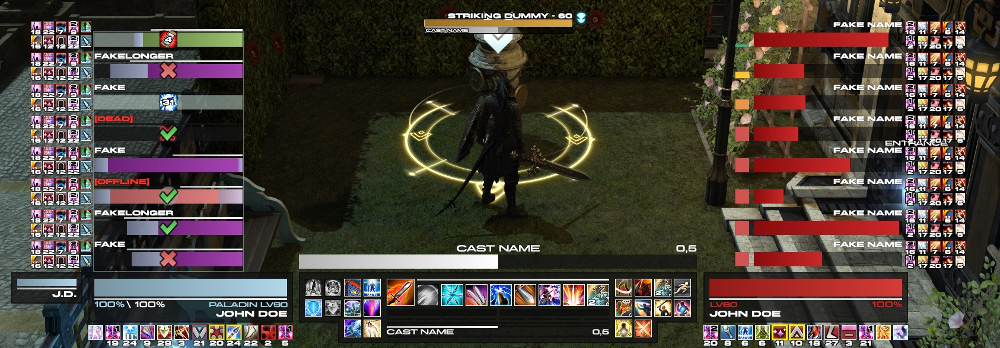
  
<h2>Introduction</h2>
My own personal UI! There's still alot of work to it when it comes to the accessibility of the DelvCD (Repositioning of icons and such) but this is still an early upload and it will get updated from time to time.
  
Mainly set to my own keybinds, this UI comes with a main actionbar consisting of an all-in-one combo button and main cooldowns/rotation abilities, altogether with situational/less important skills on the left and right side. Every skill is also set to only display when you are at a high enough level to use it, so it is also low-level-friendly (even though I may have missed one or more, who knows). Underneath them you find your main resource trackers alongside other important features according to the class together with your own casting bar and Limit Break meter. The player frame is to be found on the left, with the smaller focus target frame next to it if there has been one selected. Target frame on the right, with the target of target frame following it. Party frames are to be found on the left, and a mirrored enemy list on the right side, both tracking buffs and debuffs.
  
Please bear in mind that there are certain setbacks that come along with it, and some that I cannot fix either.
 
<h3>Available Classes</h3>
All DoW/DoM. (Excl. BLU)
  

<h2>Fonts</h2>
You can find the fonts I've used inside the subfolder. To implement them both into DelvUI and DelvCD, you need to do the following:  
First off you should find the font folder of DelvCD and place the fonts in there (It is a fixed file), you can find the path by clicking the button next to "Copy Font Folder Path to Clipboard". 
After that's done, you can click the reload button on the right next to the font name in DelvCD and the fonts should appear in the list.
  
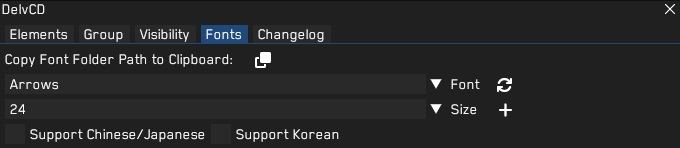
Now with the folder path still being on your clipboard, you need to paste this in the font path of DelvUI. Unlike DelvCD, you can decide where you want to keep its fonts but it's handier and easier if they both shared the same font folder. 
Press the reload button from DelvUI this time and you should be good to go!
  
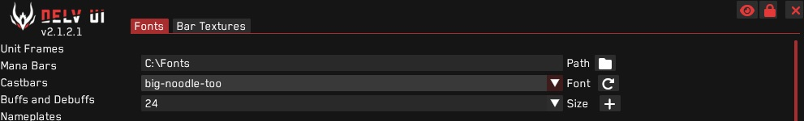
  

<h2>Known Issues:</h2>
- Clipping: The background frames might be on top of the skills due to DelvCD layering on top of DelvUI. The only way to set this correctly is to disable DelvCD, restart the game and turn it back on, but you would have to do this every time when you start up the game. So far I haven't found a fix for this, but rather a way to work around it. I installed a plugin which automatically executes a command when I log in, which enables a Dalamud collection which has DelvCD in it. Then I have created a macro which automatically turns the collection off when I press the exit game button. Not the most handy option, but atleast that does it for me.  
- Filler buttons: Some skills are just there to fill the void due to the excess amount of slots and the lack of extra abilities because of the combo button. You can remove them, you can change them, do with them whatever you like.  
- Undiscovered bugs: I haven't been able to test everything due to not having everything levelled etc etc so expect alot of errors.
   
<i>If you have any questions or find any bugs/errors/missing things whatshowever, feel free to send me a message on Discord or set up an issue.</i>
  
<h1>PREVIEWS</h1>
<h2>PLD</h2>
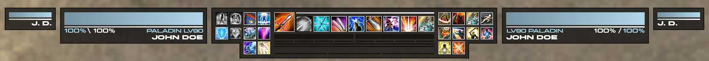

<h2>WAR</h2>
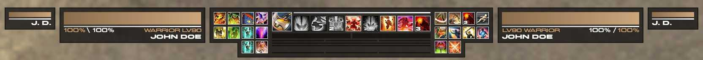

<h2>DRK</h2>
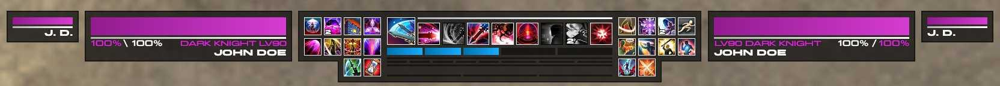

<h2>GNB</h2>
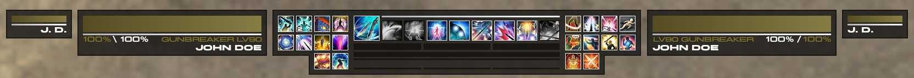

<h2>WHM</h2>
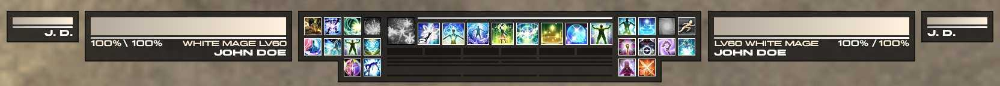

<h2>SCH</h2>
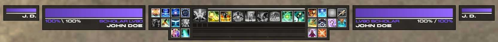

<h2>AST</h2>
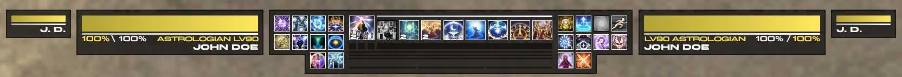

<h2>SGE</h2>
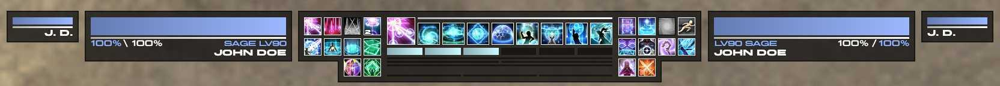

<h2>MNK</h2>
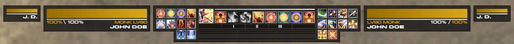

<h2>DRG</h2>
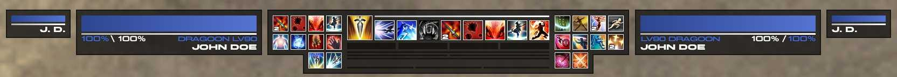

<h2>NIN</h2>
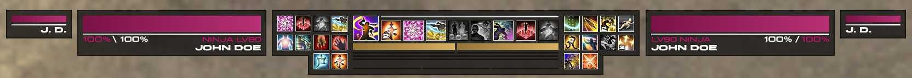

<h2>SAM</h2>
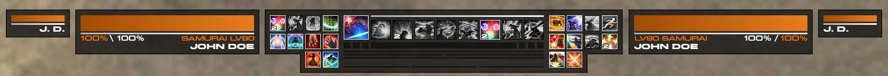

<h2>RPR</h2>
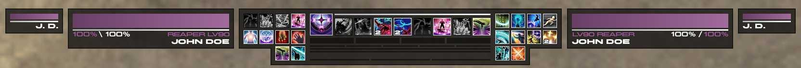

<h2>BRD</h2>
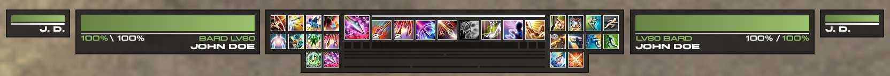

<h2>MCH</h2>
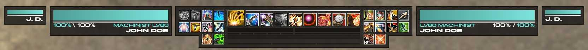

<h2>DNC</h2>
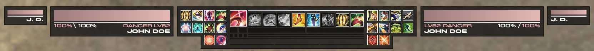

<h2>BLM</h2>
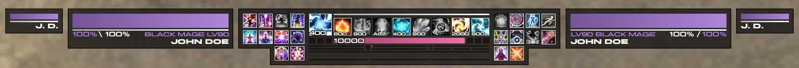

<h2>SMN</h2>
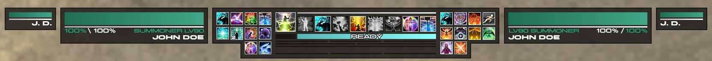

<h2>RDM</h2>
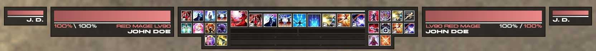
