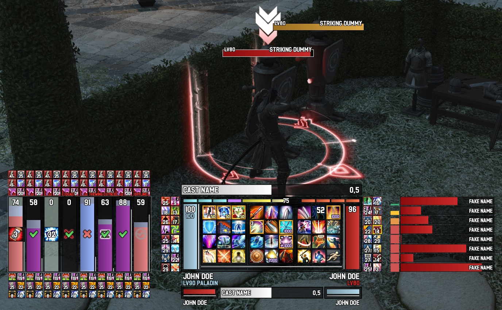
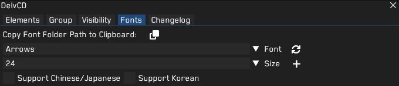
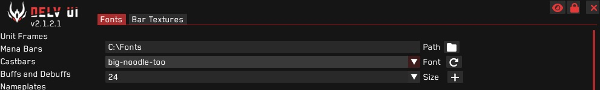

<h1>TRINE</h1>

  
<h2>Introduction</h2>
Another project of mine in the works. I've noticed there were quite some people out there reaching out for an UI built around the layout for a 12-button mouse, so I thought to give it a shot.
This is still the first draft, so for now this is only available for a few classes but more are scheduled!
  
Please bear in mind that while it's still an early build, there are certain setbacks that come along with it, and some that I cannot fix either.
  
<h3>Available Classes</h3>
PLD, WAR, GNB, DRG, NIN, SGE, BRD, RDM
 
I make these class profiles in no particular order so if you would like a certain class profile, just send me a message and I'll give it higher priority.
   

<h2>Fonts</h2>
You can find the fonts I've used inside the subfolder. To implement them both into DelvUI and DelvCD, you need to do the following:  
First off you should find the font folder of DelvCD and place the fonts in there (It is a fixed file), you can find the path by clicking the button next to "Copy Font Folder Path to Clipboard". 
After that's done, you can click the reload button on the right next to the font name in DelvCD and the fonts should appear in the list.
  

Now with the folder path still being on your clipboard, you need to paste this in the font path of DelvUI. Unlike DelvCD, you can decide where you want to keep its fonts but it's handier and easier if they both shared the same font folder. 
Press the reload button from DelvUI this time and you should be good to go!
  

  

<h2>Known Issues:</h2>
- Clipping: The background frames might be on top of the bars due to DelvCD layering on top of DelvUI. The only way to set this correctly is to disable DelvCD, restart the game and turn it back on, but you would have to do this every time when you start up the game. So far I haven't found a fix for this, but rather a way to work around it. I installed a plugin which automatically executes a command when I log in, which enables a Dalamud collection which has DelvCD in it. Then I have created a macro which automatically turns the collection off when I press the exit game button. Not the most handy option, but atleast that does it for me.  
- Undiscovered bugs: I haven't been able to test everything due to not having everything levelled etc etc so expect alot of errors.  
- Limited: Not available for every class.
   
<i>If you have any questions or find any bugs/errors/missing things whatshowever, feel free to send me a message on Discord or set up an issue.</i>
