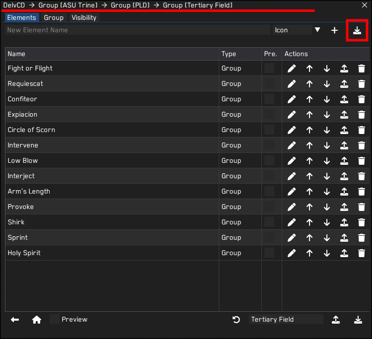

<h1>TRINE</h1>

  
<h2>Introduction</h2>
Another project of mine! I've noticed there were quite some people out there reaching out for an UI built around the layout for a 12-button mouse, so I thought to give it a shot.
 
Please bear in mind that there are certain setbacks that come along with it, some that I cannot fix due to the limitations of the tools used.
 
<h3>Available Classes</h3>
All Tanks, AST, MNK, NIN
  

<h2>Fonts</h2>
You can find the fonts I've used inside the subfolder. To implement them both into DelvUI and DelvCD, you need to do the following:  
First off you should find the font folder of DelvCD and place the fonts in there (It is a fixed file), you can find the path by clicking the button next to "Copy Font Folder Path to Clipboard". 
After that's done, you can click the reload button on the right next to the font name in DelvCD and the fonts should appear in the list.
  

Now with the folder path still being on your clipboard, you need to paste this in the font path of DelvUI. Unlike DelvCD, you can decide where you want to keep its fonts but it's handier and easier if they both shared the same font folder. 
Press the reload button from DelvUI this time and you should be good to go!
  

  

<h2>Alignment</h2>
I've placed the skills in the most logical way (for me atleast), but you might think diiferent about that. I've tried to make it as simple as possible to adjust the positions of everything without changing too much of the settings in it so that everyone can adjust it to their liking.
<h3>Same Block</h3>
How to do this, is very simple. Let's say we want to adjust the position of Holy Spirit to where Clemency is right now.
  

For this, we need to go to the group settings of Holy Spirit, which you can find in [ASU_Trine > PLD > Secondary Field > Holy Spirit]. (You go this way by clicking the Pencil Icon in its row.) 
What you will have to change are the X and Y coordinates of the group, using increments of 40px. The top left skill will always be ( x=0 : y=0 ) and the bottom right skill will be ( x=80 : y=120 ), so with that in mind, the location where Clemency is will be ( x=40 : y=120 ). Put in those values and you should be good to go!
  

  

<h3>Different Block</h3>
But what if you don't even want Holy Spirit in its current block of skills, but rather on the right block instead? Well, there's an easy solution for that.
  

Here, we need to roll back one step in the hierarchy so that you're in the list of the secondary field, [ASU_Trine > PLD > Secondary Field]. (You go this way by clicking the Pencil Icon in its row.) 
Between the other skills, you will find the group of Holy Spirit. What you need to do here is click the icon with the upwards arrow on its line so that the whole group will be copied onto your clipboard.
  

Next, we go to the Tertiary field, [ASU_Trine > PLD > Tertiary Field]. In the top-right corner, you will see an icon with a downward arrow. Click on it and the Holy Spirit group should appear in the list, along with the icon showing on the same location, but in the right block instead. 
From here, you can check the previous step on how to adjust the location of it in the block.
  

  

<h2>Known Issues:</h2>
- Clipping: The background frames might be on top of the bars due to DelvCD layering on top of DelvUI. The only way to set this correctly is to disable DelvCD, restart the game and turn it back on, but you would have to do this every time when you start up the game. So far I haven't found a fix for this, but rather a way to work around it. I installed a plugin which automatically executes a command when I log in, which enables a Dalamud collection which has DelvCD in it. Then I have created a macro which automatically turns the collection off when I press the exit game button. Not the most handy option, but atleast that does it for me.  
- Undiscovered bugs: I haven't been able to test everything due to not having everything levelled etc etc so expect alot of errors.  
   
<i>If you have any questions or find any bugs/errors/missing things whatshowever, feel free to send me a message on Discord or set up an issue.</i>
